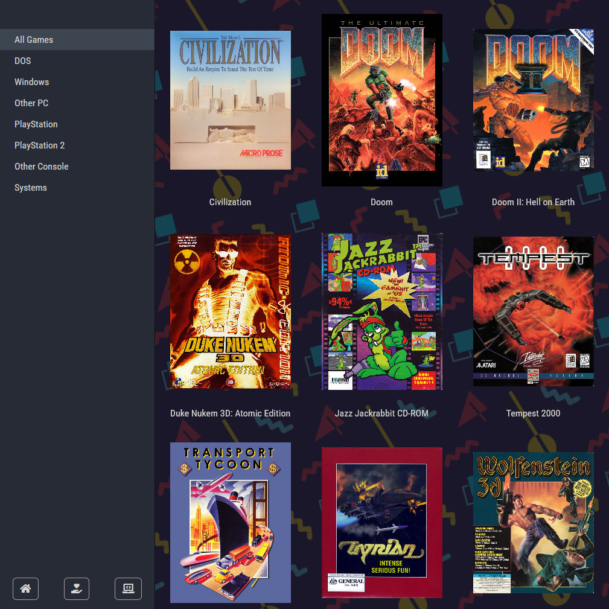

# grav-theme-crt
A Grav theme for great game collections!

This theme is based on my app, [CRT](https://github.com/phlum/crt-app), but for Grav instead.

Features list coming...eventually?

## Demo
[See it in action here!](https://gotd.spacefarer.club)

## Usage
Download the repository as a .zip, and use Grav's .zip uploader to install the theme.

### Adding platforms
The first step is to add a system you want to collect for. Add a page with the 'category' template, and give it a name like 'PlayStation', for example.

It is recommended to upload a background image for your system, but this is entirely optional.

Under taxonomies, you need to add the *platform* category. This is used to populate the sidebar.

### Adding games
The fun part! Add a child page to your PlayStation category, and call it something like 'Crash Bandicoot'. Give it the 'single-game' template. Under taxonomies, add the *game* category. Easy!

Your page's content will appear as the game's description. Write a nice description of the game, or a short review if you like. You can also upload box art, a background image, and up to three screenshots (or other images, such as photos). There are also fields for release date and developer.

If you want to embed a YouTube video, paste in the ID (something like `NWry9xA4DlM`) and it'll appear at the bottom of the page.

### Adding extra links
You can add buttons to the very bottom of the sidebar by giving them the taxonomy category `lowerNav`. These _require_ a Font Awesome icon code, otherwise they'll just be empty grey squares, and who wants that?

Add the following code in the page's frontmatter, exchanging the icon code for your own.

    custom:
        icon: fa-home
        
### Issues
Try the theme out, and report any issues in the issue tracker above. Pretty straightforward, innit.

Happy gaming.
